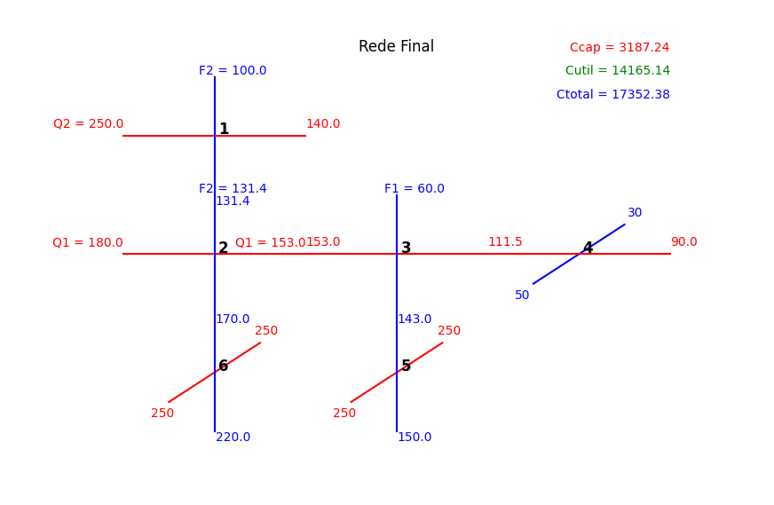
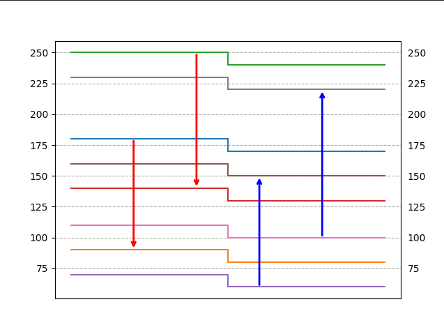
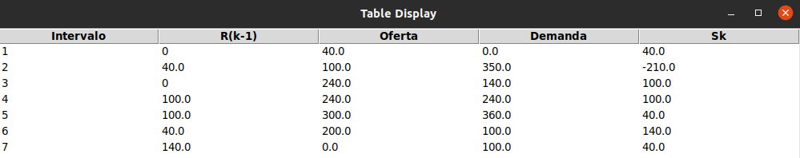

# Integração Energética
Solucionador de RTC

Para quem for usar: fique à vontade para enviar PRs, alterar as funções, corrigir bugs, etc. 

Manual de uso está na pasta "/anexos"

## Rede Final e Custos

## Oferta e demanda

